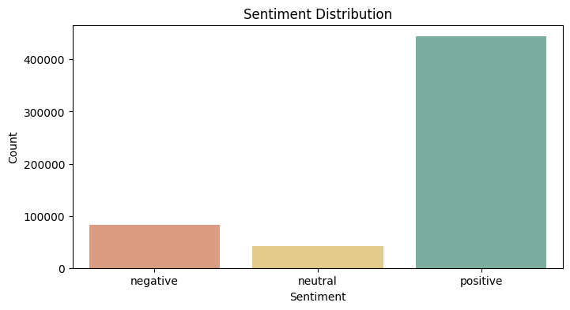
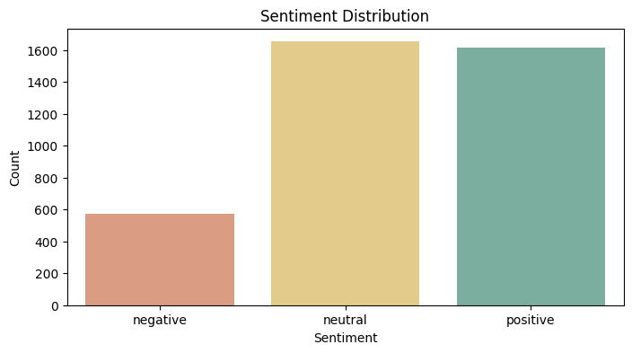
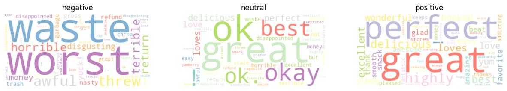
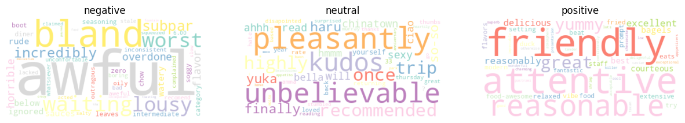
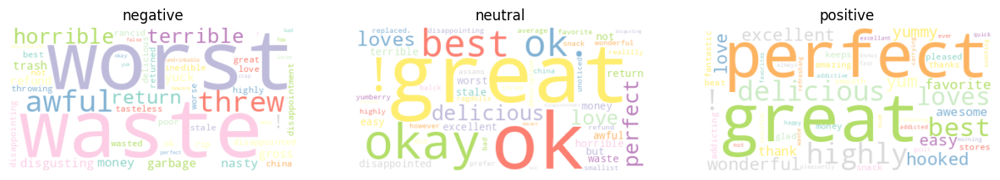
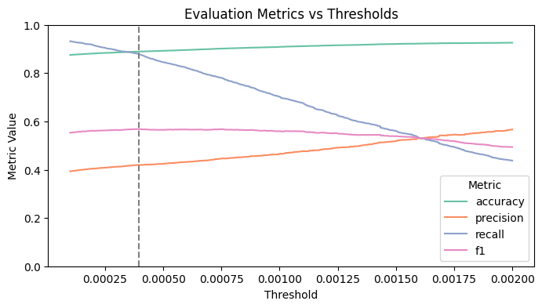

## Aspect-Based Sentiment Analysis Using `BornClassifier`

This project leverages the [Born Classifier](https://bornrule.eguidotti.com/) to perform **Aspect-Based Sentiment Analysis (ABSA)**. The primary objective is to detect aspects within text data, associate them with relevant sentences or portions, and predict sentiments for these aspects with high accuracy.

> [!IMPORTANT]
> Preview the main project files below:
> 
> | File | Instructions | Link |
> |------|--------------|------|
> | `ABSA.ipynb` | Aspect-Based Sentiment Analysis Project |  |
> | `report.pdf` | Research Paper Reporting the Experiments |  |

### NLP and ML Tools

The project is developed in `Python` using Google Colaboratory, and the following libraries are imported for NLP-related tasks:

- **Datasets:** `datasets` (HuggingFace) and `kagglehub` (Kaggle).
- **Data Handling:** `NumPy`, `Pandas`.
- **Visualization:** `Matplotlib`, `Seaborn`, `WordCloud`.
- **NLP:** `NLTK`, `spaCy`.
- **Machine Learning:** `Scikit-learn`.
- **Transformers:** `transformers` (HuggingFace) for RoBERTa and other models.

### Key Findings:

- Training the `BornClassifier` on the `SemEval2014Dataset` outperformed the trained model on `AmazonReviewsDataset` when testing on `SemEval2014Dataset` itself, highlighting the importance of domain-specific data for better generalization.
- Aspect detection worked well for simple aspects but struggled with complex noun phrases due to reliance on unigram tokenization.
- The `BornClassifier` outperformed both NLTK and RoBERTa in sentiment analysis and aspect-based sentiment analysis (ABSA).

### Future Directions:
- Develop specialized datasets that do not rely on sentiment mapping to ensure more accurate ground-truth sets.
- Address the OOV token issue to enable advanced normalization techniques and the use of n-grams for enhanced performance.

### Project Gallery

| Sentiment Distribution Amazon | Sentiment Distribution SemEval |
| --- | --- |
|  |  |

| WordCloud Amazon |
| ----- |
|  |

| WordCloud SemEval |
| ----- |
|  |

| WordCloud Joint |
| ----- |
|  |

| Threshold Optimization |
| ----- |
|  |
